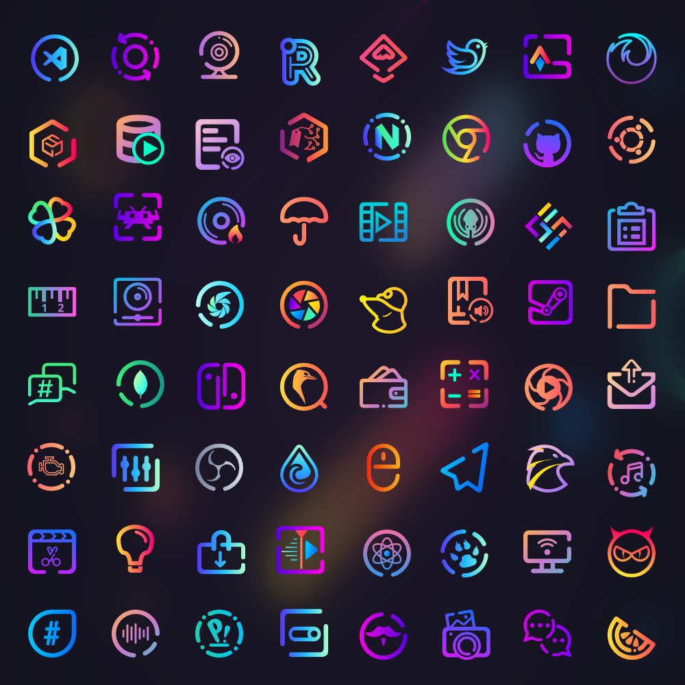

# Rice-cook
This is a python script made to rice a blank fedora i3 install into my custom configuration.

# What is does :

*  Allows DNF to update from fastest mirrors
 * Adds +10  max parallel downloads
+ Adds rpmfusion  to repos
* Adds Flathub to repos
* Copies dotfliles into ~/.config 
</br> </br>
* Installs :
*  Oh_My_zsh
	* with zsh-autosuggestions plugin
	* powerlevel10k plugin
*  25 fonts, for developers and smooth looking
*  Catppuccin themes
* candy-icons
*  [Betterlockscreen](https://github.com/betterlockscreen/betterlockscreen)
* [i3lock-color](https://github.com/Raymo111/i3lock-color)
* Finally installs all programs given in data.txt
 
________________________________________________________________________________


<a href="https://github.com/catppuccin/catppuccin"></a>
<a href="https://ohmyz.sh/"></a>
<a href="https://flathub.org/"></a>
<a href="https://github.com/EliverLara/candy-icons"></a>

##


# How to run :
```
git clone https://github.com/acidburnmonkey/rice-cook.git && cd rice-cook

```
```
chmod +x preinstall.sh && sudo ./preinstall.sh
```
```
sudo pip3 install -r requierements.txt
```
### Now move rice-cook.py & data.txt into dofiles directry and run it:
```
sudo python3 rice-cook.py
```
Should look like this .
```
|-dotfiles
|---nvim
|---ranger
|---etc...
|---data.txt
|---rice-cook.py
```

## Donate
<a href="https://www.buymeacoffee.com/acidburn" target="_blank"></a>

## Monero 


43Sxiso2FHsYhP7HTqZgsXa3m3uHtxHQdMeHxECqRefyazZfpGVCLVsf1gU68jxJBo1G171AC181q1BqAUaG1m554MLsspG


## Bitcon 


bc1qk06cyheffclx7x434zpxjzcdl50452r9ducw0x
