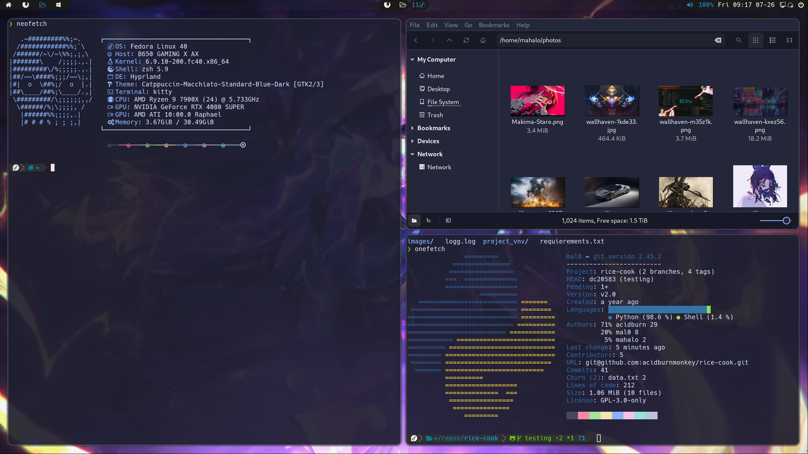

# Rice-cook <a href="#">  </a>

This is a python script made to rice a blank fedora install into my custom hyprland configuration.

# What is does :

- Allows DNF to update from fastest mirrors
  - Adds +10 max parallel downloads
- Adds rpmfusion to repos
- Adds Flathub to repos
- Copies dotfliles into ~/.config
  </br> </br>
  <span style="font-size:30px;">Installs:</span>
- Oh_My_zsh
  - with zsh-autosuggestions plugin
  - powerlevel10k plugin
- 25 fonts, for developers and smooth looking
- Catppuccin themes
- candy-icons
- Hyprland
- hyprcursor ,hypridle, hyprlang, hyprloc, hyprpaper, hyprpicker, hyprutils
- Waybar
- Finally installs all programs given in data.conf
  - dnf packages, flatpaks, copr , repos from urls

---

<a href="https://github.com/catppuccin/catppuccin"></a>
<a href="https://ohmyz.sh/"></a>
<a href="https://flathub.org/"></a>
<a href="https://github.com/EliverLara/candy-icons"></a>

##



# How to run :

```
git clone https://github.com/acidburnmonkey/rice-cook.git && cd rice-cook

```

```
chmod +x preinstall.sh && sudo ./preinstall.sh
```

### Now move `rice-cook.py` & data.conf into dofiles directory and run it:

```
sudo uv run rice-cook.py
```

Should look like this .

```
|-dotfiles
|---nvim
|---ranger
|---etc...
|---data.conf
|---rice-cook.py
```

### Before reboot

Need to correct ownership of home directory

```
sudo chown -R user:user /home/username
```

## A snapshot of your current fedora config can be genereted with this script

[link](https://github.com/acidburnmonkey/scripts/blob/main/fedora-apps.py)

## Donate

<a href="https://www.buymeacoffee.com/acidburn" target="_blank"></a>

## Monero 

43Sxiso2FHsYhP7HTqZgsXa3m3uHtxHQdMeHxECqRefyazZfpGVCLVsf1gU68jxJBo1G171AC181q1BqAUaG1m554MLsspG

## Bitcon 

bc1qk06cyheffclx7x434zpxjzcdl50452r9ducw0x
