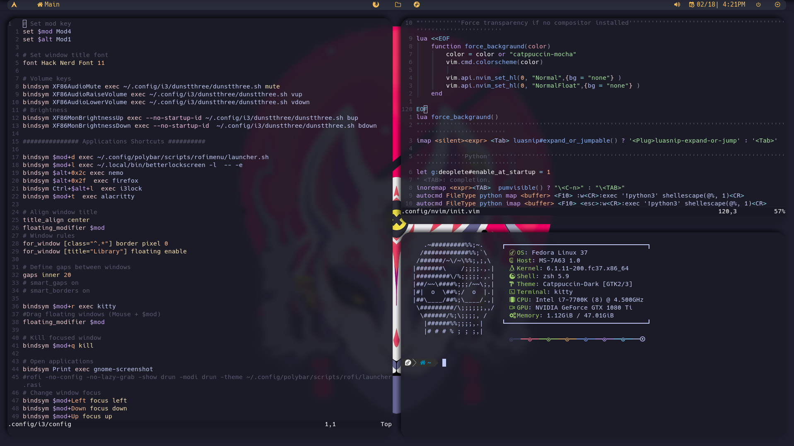

# Rice-cook
This is a python script made to rice a blank fedora i3 install into my custom configuration.

# What is does :
*  Allows DNF to update from fastest mirrors
 * Adds +10  max parallel downloads
+ Adds rpmfusion  to repos
* Installs Oh_My_zsh
	* with zsh-autosuggestions plugin
	* powerlevel10k plugin
* Adds Flathub to repos
* Copies dotfliles into ~/.config 
* Installs  25 fonts, for developers and smooth looking
* Installs Catppuccin themes.
* Installs candy-icons
* Finally installs all programs given in data.txt  
________________________________________________________________________________

	
	
	

##

## Donate

## Monero 

43Sxiso2FHsYhP7HTqZgsXa3m3uHtxHQdMeHxECqRefyazZfpGVCLVsf1gU68jxJBo1G171AC181q1BqAUaG1m554MLsspG

## Bitcon 

bc1q3p7khwp5emd463vjewf4yd7wxkxfvgyee9r49p
